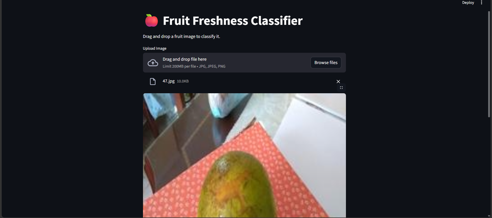
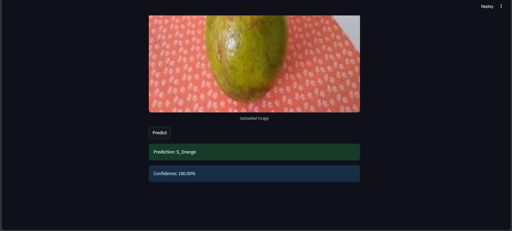

# 🍎 Fruit Freshness Classification Using Deep Learning

## 📌 Project Overview

This project focuses on classifying fruit images as **Fresh** or **Spoiled** using Deep Learning techniques. A custom Convolutional Neural Network (CNN) was developed, regularized, and fine-tuned to achieve high classification performance.

The final model was deployed using **Streamlit**, enabling users to upload fruit images through an interactive web interface and receive real-time predictions.

---

## 🎯 Objectives

- Build a deep learning model for fruit freshness classification.
- Compare different modeling approaches.
- Apply regularization techniques to improve generalization.
- Perform hyperparameter tuning for performance optimization.
- Deploy the final model through a Streamlit application.

---

## 🗂️ Dataset Information

The dataset consists of **16 classes** representing fresh and spoiled fruits.

### Fresh Fruits

- F_Banana
- F_Lemon
- F_Lulo
- F_Mango
- F_Orange
- F_Strawberry
- F_Tamarillo
- F_Tomato

### Spoiled Fruits

- S_Banana
- S_Lemon
- S_Lulo
- S_Mango
- S_Orange
- S_Strawberry
- S_Tamarillo
- S_Tomato

---

## 🧠 Model Development

### 1. Baseline CNN Model

A custom Convolutional Neural Network was developed using:

- Convolutional Layers
- ReLU Activation
- Max Pooling Layers
- Fully Connected Layers

The baseline model provided strong initial performance.

---

### 2. Regularization Techniques

To improve generalization and reduce overfitting, the following techniques were applied:

- Batch Normalization
- Dropout (0.5)
- Weight Decay (L2 Regularization)

These techniques improved model robustness and validation performance.

---

### 3. Hyperparameter Tuning

The regularized CNN model was further optimized using:

- Learning Rate Tuning
- Weight Decay Tuning

The best-performing hyperparameter combination was selected for final training.

---

### 4. Transfer Learning Experiment

A ResNet50-based model was also evaluated.

Although transfer learning achieved competitive results, the tuned custom CNN delivered excellent performance while maintaining lower computational complexity and was therefore selected as the final model.

---

## 📊 Model Performance

### Final Test Accuracy

**97.33%**

### Performance Analysis

- Training and validation accuracy improved consistently across epochs.
- Validation accuracy closely followed training accuracy.
- No significant underfitting was observed.
- Regularization techniques effectively controlled overfitting.
- The model demonstrated strong generalization on unseen test data.

---

## ⚙️ Technologies Used

- Python
- PyTorch
- TorchVision
- NumPy
- Matplotlib
- Pillow (PIL)
- Streamlit
- Jupyter Notebook
- PyCharm

---

## 🚀 Streamlit Application

The trained model was deployed using Streamlit to provide an intuitive user interface for fruit freshness classification.

### Features

- Drag-and-drop image upload
- Real-time image classification
- Fresh/Spoiled prediction
- Confidence score display
- User-friendly interface

---

## 📸 Application Screenshots

### Drag&Drop Screen



### Prediction Result



---

## 📁 Project Structure

```text
Fruit-Freshness-Classification/
│
├── app.py
├── main.py
├── final_tuned_model.pth
├── requirements.txt
├── README.md
│
├── screenshots/
│   ├── home_page.png
│   └── prediction_result.png
│
├── dataset/
│
└── model.ipynb
```

---

## ▶️ Installation

Clone the repository:

```bash
git clone <repository-url>
```

Move into the project directory:

```bash
cd Fruit-Freshness-Classification
```

Install dependencies:

```bash
pip install -r requirements.txt
```

---

## ▶️ Running the Application

Launch the Streamlit app:

```bash
streamlit run app.py
```

The application will open in your default browser.

---

## 🔮 Future Improvements

- Expand dataset size and diversity.
- Experiment with advanced transfer learning architectures.
- Deploy the application to the cloud.
- Support batch image prediction.
- Integrate explainable AI visualizations.

---

## 👩‍💻 Author

**Anuja Nagrikar**

M.Sc. Data Science & Big Data Analytics

Deep Learning Project – Fruit Freshness Classification